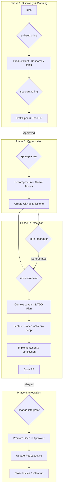

# AgenticDev

**AgenticDev** is a modular, spec-driven development methodology designed to empower AI agents and developers to build software efficiently, safely, and autonomously. It provides a structured framework that bridges the gap between high-level ideas and production-ready code.

## Core Philosophy

AgenticDev operates on a simple but rigorous principle: **Think before you code.**

1.  **Spec-First**: Every feature starts with a written specification ("spec").
2.  **Verification Loops**: Implementation is bound by TDD cycles—reproduction first, then fix.
3.  **Atomic Execution**: Work is broken down into small, manageable units (Issues).
4.  **Autonomous Integration**: Merging code triggers automated documentation updates and cleanup.

## The Workflow

The AgenticDev lifecycle moves a project from concept to completion through four distinct phases:

## Skills Catalog

All capabilities are implemented as modular "Skills" located in the `skills/` directory.

### 1. Setup & Maintenance
*   **`project-init`**: Scaffolds a new project with the required `docs/specs` and `docs/changes` structure.
*   **`project-migrate`**: Intelligently migrates existing "brownfield" projects to the AgenticDev structure using AI analysis.
*   **`agent-integrator`**: Updates the `AGENTS.md` file to register skills for agent discovery.
*   **`skill-lister`**: Discovers and lists all available skills in the project.
*   **`doc-validator`**: Enforces documentation standards and prevents "doc sprawl" by checking file locations.

### 2. Planning & Discovery
*   **`prd-authoring`**: Generates Product Briefs, Research Plans, and full PRDs from initial ideas using AI.
*   **`spec-authoring`**: Manages the "Spec PR" workflow, drafting detailed technical specifications and analyzing PR feedback.
*   **`doc-indexer`**: Scans project documentation to provide a just-in-time context map (frontmatter index) for the agent.

### 3. Sprint Management
*   **`sprint-planner`**: Decomposes approved specs (Epics) into atomic GitHub Issues and organizes them into milestones.
*   **`sprint-manager`**: Orchestrates the autonomous execution of an entire sprint by coordinating sub-agents to implement issues serially.

### 4. Execution & Integration
*   **`issue-executor`**: The core workhorse. Takes a single issue, generates a TDD plan (Repro → Fix → Verify), creates a branch, and manages the implementation loop.
*   **`change-integrator`**: Post-merge cleanup tool. Promotes specs to "approved," updates the `RETROSPECTIVE.md` with learnings (auto-summarized), and closes related issues.
*   **`frontend-design`**: A specialized agent for handling UI/UX tasks and frontend component design.

## Getting Started

### For New Projects
1.  Clone this repository or copy the `skills/` directory.
2.  Run `bash skills/project-init/scripts/init-project.sh` to scaffold your docs.
3.  Run `bash skills/agent-integrator/scripts/update-agents-file.sh` to create `AGENTS.md`.

### For Existing Projects
1.  Run `bash skills/project-migrate/scripts/project-migrate.sh` to analyze and migrate your docs.

## Contributing

We follow our own methodology:
1.  Use `spec-authoring` to propose a change.
2.  Submit a Spec PR.
3.  Once approved, we'll plan it into the next sprint.

## License

MIT License - See LICENSE file for details.